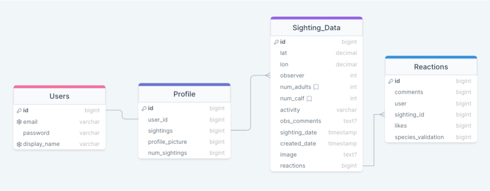

# [ManateeWatch](http://manateewatch.com)

## Summary

[ManateeWatch](http://manateewatch.com) is designed to help people find up-to-date manatee sighting locations in their area. Florida is well known for being home to manatees, but spotting them can be tricky. This app serves as a one-stop map to show where manatees are, where they have been, and helps users predict where they might be next.

## Features

- **Manatee Sighting Information**: Users can upload photos, coordinates, and information about manatees they have spotted.
- **Sighting Map**: A shared map populated with user-uploaded sightings.
- **User Accounts**: Sightings are associated with user accounts for easy editing or deletion.
- **Future Features**: Implementation of a k-nearest neighbor algorithm to predict manatee locations based on recorded sightings.

## Purpose

[ManateeWatch](http://manateewatch.com) aims to help locals and tourists alike find manatees in their natural habitat. By providing a platform for users to share sightings and track manatee locations, the app contributes to the appreciation and conservation of these gentle sea creatures. Users can discover, join, and organize manatee sighting events, and track their contributions to manatee conservation efforts.

## MVP (Minimum Viable Product)

The MVP includes:

- **User Authentication**: Secure login and access to the platform's features.
- **User Profile CRUD Methods**: Create, read, update, and delete profile information.
- **Manatee Sighting CRUD Methods**: Create, manage, and search for manatee sightings.
- **Integration with Mapbox**: Location-based features for tracking and displaying manatee sightings.
- **Monthly/Weekly Sighting Challenges**: Encourage user participation in recording sightings.
- **Manatee Tracker Component**: Track and display users' contributions to manatee sighting efforts.

## Additional App Goals/Functionality

Additional functionalities include:

- **Gamification**: Assign badges based on completed challenges.
- **Social Media Integration**: Share manatee sighting events and locations.
- **Local Event API Integration**: Import events related to manatee conservation from various platforms.
- **AI Integration**: Enhance features for predicting manatee sightings.

## Database Schema

The ManateeWatch database is built using PostgreSQL. Below is a visual representation of the schema, followed by a description of the key tables:

- **Users Table**: Stores user information such as username, password, and email.
- **Profiles Table**: Contains additional user profile details like observer stats and profile picture.
- **Sightings Table**: Records details of each manatee sighting including observer ID, sighting data and links to observation reactions.
- **Reactions Table**: Records comments, likes, and species validation flags for each reported sighting.

## Contributing to [ManateeWatch](manateewatch.com)

We welcome contributions from the community! If you'd like to contribute to this project, please follow these guidelines:

1. Fork the repository and clone it to your local machine.
2. Create a new branch for your feature or bug fix: `git checkout -b feature/my-feature` or `git checkout -b bugfix/my-bug-fix`.
3. Make your changes and commit them: `git commit -m 'Add some feature'`.
4. Push to the branch: `git push origin feature/my-feature`.
5. Submit a pull request against the `main` branch.

Please ensure that your pull request adheres to the following guidelines:

- Describe your changes in detail and provide a clear explanation of the problem your PR is solving.
- Ensure that your code follows the project's coding standards and conventions.
- Include tests if applicable.
- Update the README if your changes introduce new functionality or affect existing features.
- Review and adhere to the [Code of Conduct](CODE_OF_CONDUCT.md).

For detailed instructions on installation prerequisites and setting up the Django backend and React frontend to contribute, please refer to the [Contributor Setup Guide](CONTRIBUTE.md).

Thank you for your contribution!

## License

This project is licensed under the MIT License - see the [LICENSE](LICENSE) file for details.

## Contact

If you have any questions, feel free to reach out to me at [kdwwatts@gmail.com](mailto:kdwwatts@gmail.com).
Make sure to check out the site at [manateewatch.com](http://manateewatch.com)

