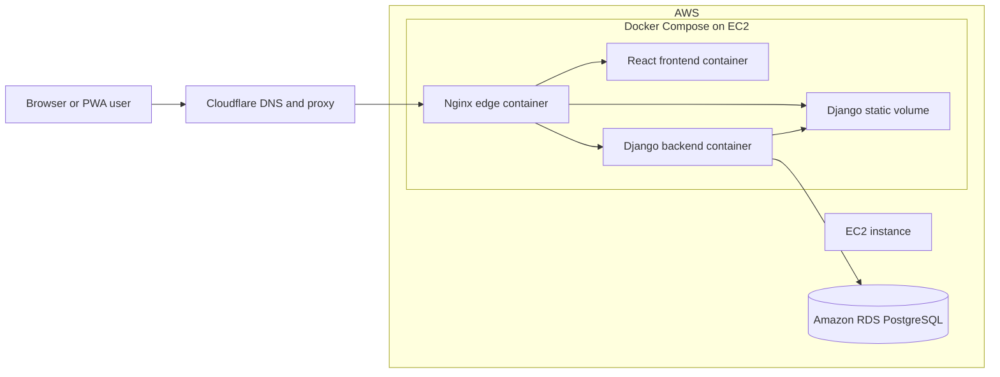
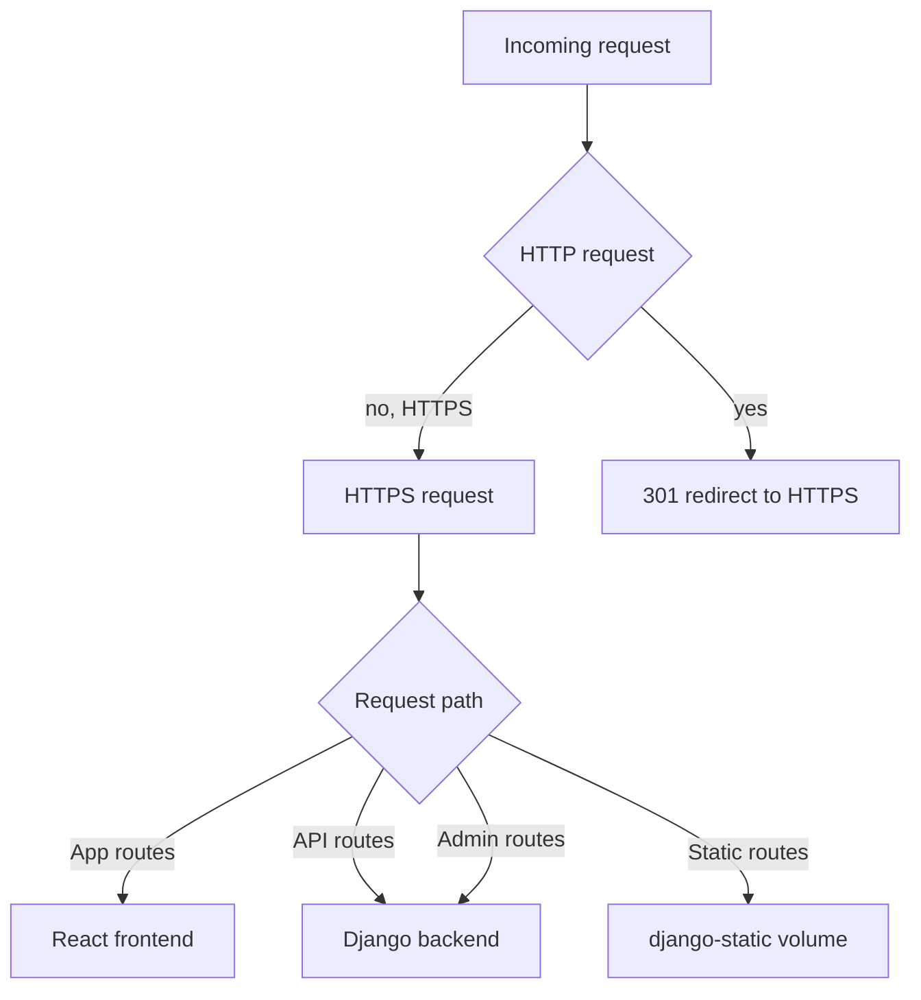
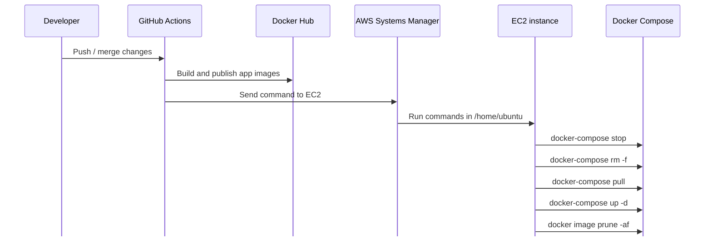
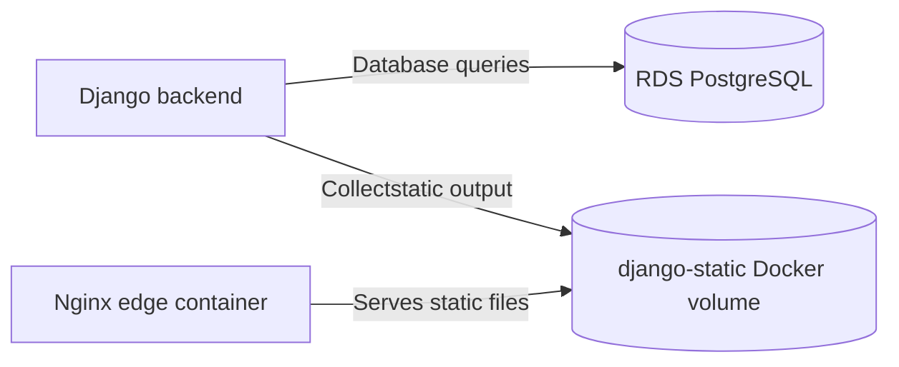

# ManateeWatch Architecture

This document describes the production architecture used by `manateewatch.com`.

For local setup and test commands, see [Local Development And Testing](local-development.md).

## System Overview

These diagrams use Mermaid. GitHub renders Mermaid blocks automatically; local IDE previews may need Mermaid support enabled or a Mermaid markdown extension installed.



Cloudflare terminates public DNS and proxies traffic for `manateewatch.com` and `www.manateewatch.com`. The origin is an EC2 instance running Docker Compose. The public-facing container is `nginx`; it proxies browser traffic to the internal frontend and backend containers.

## Runtime Containers

The production compose stack is defined in [`docker-compose.yml`](../docker-compose.yml).

| Service | Image | Role | Network name | Published ports |
| --- | --- | --- | --- | --- |
| `nginx` | `kdwwatts/manateewatch-nginx:latest` | Public edge proxy and TLS endpoint | `nginx` | `80:80`, `443:443` |
| `frontend` | `kdwwatts/manateewatch-fe:latest` | Serves the React production build | `frontend` | `3000:3000` |
| `backend` | `kdwwatts/manateewatch-be:latest` | Django API served by Gunicorn | `backend` | `8000:8000` |

All three services join the `manateewatch-network` Docker bridge network. Nginx relies on Docker DNS names like `frontend` and `backend`, so the frontend and backend containers must exist on that network before nginx can start successfully.

## Request Routing

Routing is configured in [`nginx/manateewatch-nginx.conf`](../nginx/manateewatch-nginx.conf).



The frontend is built as a static React app and served by its own nginx container on port `3000`. API calls use `REACT_APP_API_URL=https://manateewatch.com`, so public browser requests still flow back through Cloudflare and the edge nginx container.

The backend is a Django app served by Gunicorn on `0.0.0.0:8000`. Django uses PostgreSQL via the `DB_*` environment variables loaded from `backend/.env` on the EC2 host.

## Deployment Flow

Production deployment is driven by GitHub Actions and AWS Systems Manager.



The EC2 deployment command is configured in [`.github/workflows/ec2.yml`](../.github/workflows/ec2.yml). It expects the compose file and environment files to exist on the EC2 host under `/home/ubuntu`.

Docs-only pushes to `main` do not trigger image builds or deployment. The frontend and backend build workflows ignore changes under `docs/**` and root-level Markdown files, and the EC2 deployment workflow only runs after the frontend workflow completes successfully.

## Data And Static Assets



PostgreSQL is hosted outside Docker in Amazon RDS. The backend container connects to RDS using the environment variables in `backend/.env`.

Django static files are shared through the `django-static` Docker volume. The backend writes collected static files into the volume, and nginx serves them under `/django_static/`.

## Operational Notes

- Cloudflare 521 usually means the EC2 origin refused the connection. In this architecture, the first thing to check is whether the `nginx` container is running and publishing ports `80` and `443`.
- If nginx logs show `host not found in upstream "backend"`, the backend container is missing or not attached to the compose network. Start the backend first, then restart nginx.
- The backend and frontend are currently published on host ports `8000` and `3000`. Nginx only needs to reach them over Docker networking, so those host port mappings can be tightened in a future hardening pass.
- Dollar signs in `.env` values must be escaped as `$$` when Docker Compose reads the file, otherwise Compose may try to interpolate them as variables.

## Useful Production Checks

Run these from the EC2 instance:

```bash
cd /home/ubuntu
sudo docker-compose ps
sudo docker-compose logs --tail=120 nginx
sudo docker-compose logs --tail=120 backend
sudo ss -ltnp | grep -E ':80|:443|:3000|:8000'
```

Expected healthy state:

- `nginx`, `frontend`, and `backend` are all `Up`.
- Nginx publishes `0.0.0.0:80->80/tcp` and `0.0.0.0:443->443/tcp`.
- Backend listens on `0.0.0.0:8000` inside its container.
- Frontend listens on `3000` inside its container.
